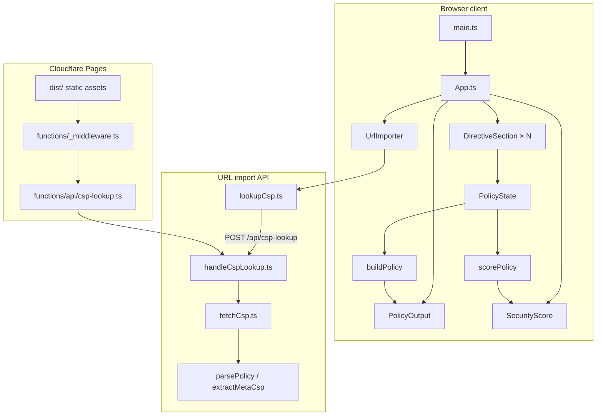

# CSP Playground architecture

Browser-based Content Security Policy builder with URL import, security scoring, and server export snippets. The app is a static site on Cloudflare Pages with one Pages Function for remote CSP lookup.

## High-level flow



## Module boundaries

| Area | Path | Role |
|------|------|------|
| CSP core | `src/csp/` | Parse, build, validate, score policies; keywords; hashes; server export strings. Pure logic, no DOM. |
| UI | `src/ui/` | Form components, output panel, helpers (nonce, style hash, import). Vanilla DOM factories (`createX`). |
| Client API | `src/api/` | `fetch` wrapper for `/api/csp-lookup`. |
| Shared server | `server/` | Lookup handler and fetch logic used in **both** Vite dev and production. Web APIs only. |
| Pages Functions | `functions/` | Thin adapters: CSP lookup POST handler, Brotli static middleware. |
| SSG shell | `src/ssg/` | Pre-renders `#app` HTML at build time; client hydrates via `main.ts`. |

**Rule of thumb:** policy semantics live in `src/csp/`; wiring and DOM live in `src/ui/`; network lookup lives in `server/` and is exposed through `functions/` or the Vite plugin.

## Policy state lifecycle

1. Each enabled directive is a `DirectiveSection` with `{ enabled, values }`.
2. `App.ts` collects sections into a `PolicyState` object keyed by directive name.
3. On change, `createPolicyUpdateSnapshot()` runs `buildPolicy()` and passes the result to `PolicyOutput` and `SecurityScore`.
4. Import flows (`UrlImporter`, paste) parse external CSP text and call `applyPolicy()` to push state into sections.

Canonical directive metadata (names, categories, control types) is **`src/csp/directives.ts`**. Sandbox flag tooltips load from `public/data/flag-descriptions.json`.

## Build and runtime

| Phase | What runs |
|-------|-----------|
| `yarn dev` | Vite + `cspLookupPlugin` (dev middleware for `/api/csp-lookup`) |
| `yarn build` | Typecheck → Vite bundle → `_headers` → Brotli sidecars |
| Production | Static `dist/` + Pages Functions on the edge |

`vite.config.ts` injects site meta, footer, and SSG app HTML via `transformIndexHtml` plugins. Git commit short hash is baked in at build time (`__GIT_COMMIT_SHORT__`).

## `/api/csp-lookup` contract

**Request:** `POST` with JSON body `{ "url": "https://example.com" }` (max 4 KiB body).

**Success (200):**

```json
{
  "url": "https://example.com/",
  "policy": "default-src 'self'",
  "reportOnly": false,
  "source": "header-enforce"
}
```

`source` is one of: `header-enforce`, `header-report-only`, `meta-enforce`, `meta-report-only`.

**Errors:** JSON `{ "error": "<code>", "message": "..." }` with HTTP status:

| Code | Typical status |
|------|----------------|
| `invalid_url` | 400 |
| `no_csp` | 404 |
| `blocked_url` | 400 |
| `fetch_failed` | 500 |

Types: `CspLookupResponseBody` in `server/handleCspLookup.ts`. Client mapping: `src/api/lookupCsp.ts`.

## SSRF protections (lookup)

`server/fetchCsp.ts` normalizes URLs and rejects:

- Non-HTTP(S) schemes, credentials in URL, localhost, `.local`, private/reserved IPs
- Redirect loops and oversized HTML bodies

Lookup order: `HEAD` headers → `GET` headers → HTML `<meta http-equiv="Content-Security-Policy*">`.

## Testing strategy

- **Vitest + jsdom** for unit and DOM tests under `tests/`, mirroring `src/` and `server/` layout.
- **Playwright** for browser smoke tests in `e2e/` against `vite preview` + `dist/`.
- High coverage thresholds in `vitest.config.ts`; branch coverage below 100% reflects defensive DOM paths rather than missing tests.
- **`yarn typecheck`** — `src/` plus `server/` / `functions/` via separate tsconfigs.
- **`yarn lint`** — Biome check (format + lint).

## Tooling and dependency bots

| Tool | Purpose |
|------|---------|
| Renovate | npm / Yarn version updates (exact pins) |
| Dependabot | GitHub Actions workflow pins |
| Biome | Format and lint |
| `yarn verify:deps` | Lockfile integrity after dependency changes |

See [AGENTS.md](../AGENTS.md) for agent conventions and Cloudflare Pages v3 pins.
